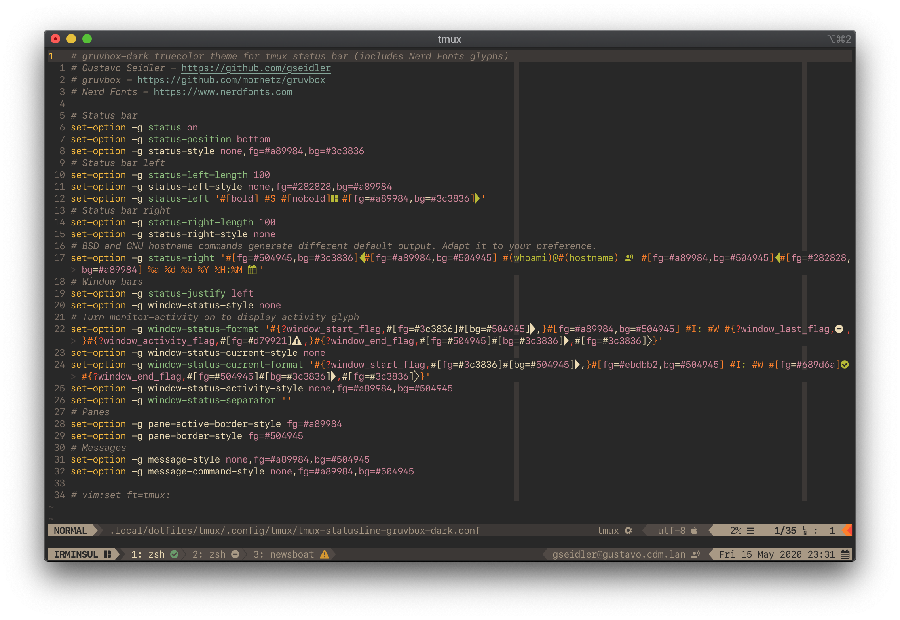

# tmux-statusline-gruvbox-dark

A custom tmux status line configuration for truecolor terminals using
[gruvbox-dark](https://github.com/morhetz/gruvbox) color scheme. It contains
font glyphs found on [Nerd Font](https://www.nerdfonts.com) patched fonts.

## Installation

Copy it to a suitable directory and source it from within your existing
`tmux.conf`. Example:

```INI
# Use gruvbox-dark theme if terminal supports truecolor
if-shell '[ "$COLORTERM" = "truecolor" ]' \
	'source-file "$HOME/.config/tmux/tmux-statusline-gruvbox-dark.conf"'
```

## Screenshot


